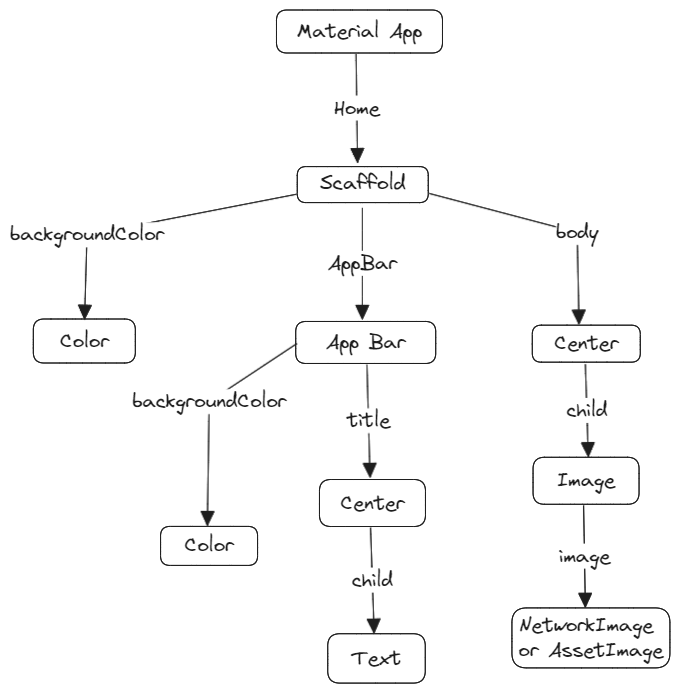

# The Complete Flutter Development Bootcamp with Dart - Dr. Angela Yu

This repository is meant to be a learning repository with examples going from easier to harder.

All these projects are from the course <a href="https://www.udemy.com/course/flutter-bootcamp-with-dart/">Flutter Bootcamp with Dart</a> and are going to be enumerated from 0 (Easy) to N (Hard).

<details>
  <summary>Useful Resources</summary>
   
   1. <a href="https://docs.flutter.dev/ui/widgets">Flutter Widget Catalog</a>
   2. <a href="https://icons8.com/">Iconos8</a>
   3. <a href="https://www.vecteezy.com/">Vecteezy</a>
   4. <a href="https://www.canva.com/">Canva</a>
   5. <a href="https://medium.com/flutter-community/flutter-layout-cheat-sheet-5363348d037e">Flutter Layout Cheat Sheet</a>
   6. <a href="https://www.flutterbeads.com/circular-image-in-flutter/?expand_article=1">Circular Using CircleAvatar</a>
   7. <a href="https://flutter.io/custom-fonts/#from-packages">Integrate Custom Fonts</a>
   8. <a href="https://api.flutter.dev/flutter/widgets/Icon-class.html">Icons Class - Using icons like phone, envelope, etc.</a>
   9. <a href="https://fonts.google.com/icons">Available Icons for Flutter</a>
   10. <a href="https://www.materialpalette.com/">Intelligent Icon Color Palette Choosing</a>
   11. <a href="https://api.flutter.dev/flutter/material/Card-class.html">Card Widget</a>
   12. <a href="https://api.flutter.dev/flutter/widgets/Padding-class.html">Padding Class - For widgets that don't have padding property</a>
   13. <a href="https://api.flutter.dev/flutter/material/ListTile-class.html">ListTile - Display Icons and Text in Card Widgets</a>
</details>

## Apps Developed
### 1. I Am Rich
This project is based on the functionality of the I Am Rich original app, with the sole purpose of showing the most basic functionality and structure of the Dart language and the Flutter framework.

I Am Rich is a 2008 mobile app for iPhones which had minimal function and was priced at US$999.99 (equivalent to $1,359 in 2022). The app was pulled from the App Store less than 24 hours after its launch. Receiving poor reviews from critics, only eight copies were sold. In the years since, several similar applications have been released at lower prices.

<details>
  <summary>I Am Rich - Notes</summary>
  
  #### 24. Creating a New Flutter Project from Scratch
  1. <a class="documentation" href="https://api.flutter.dev/flutter/material/MaterialApp-class.html">MaterialApp()</a>
  2. <a class="documentation" href="https://api.flutter.dev/flutter/widgets/Center-class.html">Center()</a>
     * child: <a class="documentation" href="https://api.flutter.dev/flutter/widgets/Text-class.html">Text()</a>

  Code Added/Modified
  ```
    void main() {
        runApp(
            const MaterialApp(
                home: Center(
                child: Text('Hello World'),
                ),
            ),
        );
    }
  ```

  #### 26. Scaffolding a Flutter App
  1. <a href="https://api.flutter.dev/flutter/material/Scaffold-class.html">Scaffold()</a>
     * <a href="https://api.flutter.dev/flutter/material/AppBar-class.html">AppBar()</a>
         * title: Center(child: Text())
         * backgroundColor: <a href="https://api.flutter.dev/flutter/material/Colors-class.html">Colors</a>
     * body: <a href="https://api.flutter.dev/flutter/widgets/Image-class.html">Image()</a>
         * image: NetworkImage('url')
     * backgroundColor: Colors.blueGrey[200]

  Code Added/Modified
  ```
    void main() {
        runApp(
            MaterialApp(
                home: Scaffold(
                    appBar: AppBar(
                    title: Center(
                        child: Text("I Am Rich"),
                    ),
                    backgroundColor: Colors.blueGrey[900],
                    ),
                    body: Center(
                        child: Image(
                            image: NetworkImage(
                                'https://camo.githubusercontent.com/dc130e15e764a2ce83daf7503c9b73e5ee349259ceb82b4a0f393339289f8564/68747470733a2f2f63646e2d696d616765732d312e6d656469756d2e636f6d2f6d61782f313230302f312a352d616f4b3849426d58766535776842514d393047412e706e67'))),
                    backgroundColor: Colors.blueGrey[200],
                ),
            ),
        );
    }
  ```

  #### 27. Working with Assets in Flutter & the Pubspec file
  1. Image()
     * AssetImage('images/diamond.png'),
  * Notes:
     * To add images to the project you have to modify the pubspec.yaml by adding an <i>assets</i> section as a child of the flutter section

  #### Section 4: Running Your App on a Physical Device
  1. Enable Developer Mode
     * Settings > Search for Build number
     * Tap the Build Number until you get the pop up saying that you're now a developer
  2. Go to Developer options and enable USB Debugging
  3. Connect the Phone with USB
  4. Trust Your Computer if Prompted
  5. Run App in your Phone

  * Notes:
     * If needed you can check -> <a href="https://blog.londonappbrewery.com/troubleshooting-android-device-testing-on-windows-a2b5d779df08">Troubleshooting Android Device Testing</a>
     * Troubleshooting MIUI 9 and above
         1. Settings -> Additional Settings -> Developer options ->
         2. Turn off "MIUI optimization" and Restart
         3. Turn On "USB Debugging"
         4. Turn On "Install via USB"
         5. MTP(Media Transfer Protocol) is the default mode.
         6. Works even in MTP in some cases
         7. Set USB Configuration to Charging

</details>
<details>
  <summary>I Am Rich - Widget Tree</summary>
  

</details>

### 2. I Am Poor - App Challenge
This project is a counterpart of the I Am Rich app developed from Section 1 through Section 4 in order to test our learning from the previous sections.

I Am Rich is a 2008 mobile app for iPhones which had minimal function and was priced at US$999.99 (equivalent to $1,359 in 2022). The app was pulled from the App Store less than 24 hours after its launch. Receiving poor reviews from critics, only eight copies were sold. In the years since, several similar applications have been released at lower prices.

<details>
  <summary>I Am Poor - Notes</summary>
  
  #### Section 5: I Am Poor - App Challenge
  Using what you have learnt from the I Am Rich app, you'll be building a simple Flutter app from scratch. If you head over to this link, you can download the Widget tree structure:

  <a href="https://drive.google.com/uc?export=download&id=1DcvqcMiRD9GA9Cci9akfSMDfPd9Nrn3e">Widget Tree Structure</a>

  Using the Widget tree structure, create an app called I Am Poor, using everything you have learnt so far. Try to customise the app as much as you can to make it your own!

  You can use your own images, or simply find one from the internet.
</details>

<details>
  <summary>I Am Poor - Widget Tree</summary>
  

</details>


### 3. My Card

#### Our Goal
Now that you've seen how to create a Flutter app entirely from scratch, we're going to go further and learn more about how to design user interfaces for Flutter apps.

#### What you will create
Mi Card is a personal business card. Imagine every time you wanted to give someone your contact details or your business card but you didn't have it on you. Well, now you can get them to download your business card as an app.

#### What you will learn
* How to create Stateless Widgets
* What is the difference between hot reload and hot refresh and running an app from cold
* How to use Containers to lay out your UI
* How to use Columns and Rows to position your UI elements
* How to add custom fonts
* How to add Material icons
* How to style Text widgets
* How to read and use Flutter Documentation

<details>
  <summary>My Card - Notes</summary>

  ## 40. Hot Reload and Hot Restart - Flutter Power Tools
  Notes:
   * In order for the Hot Reload to work the widgets should be inside of a Stateful or a Stateless widget
  
  ## 41. How to Use Container Widgets
  Documentation:
   * <a href="https://docs.flutter.dev/ui/widgets">Widget Catalog</a>
   * <a href="https://docs.flutter.dev/ui/widgets/layout">Layout Widgets</a>
  <a href="https://api.flutter.dev/flutter/widgets/Container-class.html">Container Class Widget</a>

  Notes:
   * A <b>layout</b> is the way in which the parts of something are arranged or laid out.
   * In Flutter there are multi-child and single-child layout widgets
     * A container is a single-child widget
     * Rows and Columns are multi-child widgets
   * A container widget is basically a box or a div when you see it from the web developer perspective.
</details>

### 4. Dicee 🎲

#### Our Goal
The objective of this tutorial is to introduce you to the core programming concepts that will form the foundation of most of the apps you’ll build in the future. This app will teach you how to make apps with functionality using setState() inside Stateful Flutter widgets.

#### What you will create
We’re going to make a Las Vegas dice app. You can make the die roll at the press of a button. With this app in your pocket, you’ll be able to settle any score on the go!


#### What you will learn
- How to use Flutter stateless widgets to design the user interface.
- How to use Flutter stateful widgets to update the user interface.
- How to change the properties of various widgets.
- How to use onPressed listeners to detect when buttons are pressed.
- How to use setState to mark the widget tree as dirty and requiring update on the next render.
- How to use Expanded to make widgets adapt to screen dimensions.
- Understand and use string interpolation.
- Learn about basic dart programming concepts such as data types and functions.
- Code and use gesture controls.

<details>
  <summary>I Am Poor - Widget Tree</summary>
  

</details>