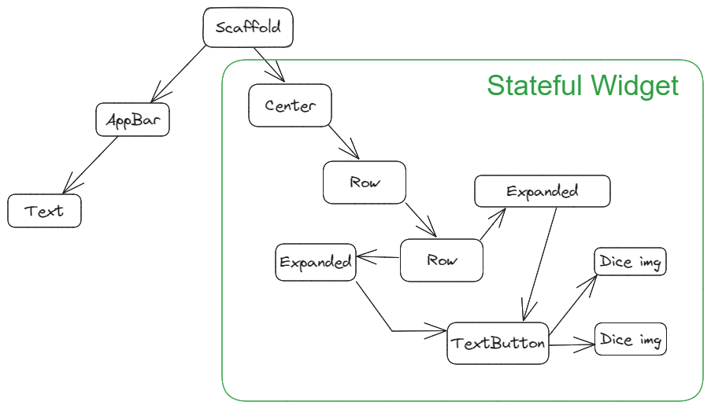

# Dicee 🎲

#### Our Goal
The objective of this tutorial is to introduce you to the core programming concepts that will form the foundation of most of the apps you’ll build in the future. This app will teach you how to make apps with functionality using setState() inside Stateful Flutter widgets.

#### What you will create
We’re going to make a Las Vegas dice app. You can make the die roll at the press of a button. With this app in your pocket, you’ll be able to settle any score on the go!

#### What you will learn
- How to use Flutter stateless widgets to design the user interface.
- How to use Flutter stateful widgets to update the user interface.
- How to change the properties of various widgets.
- How to use onPressed listeners to detect when buttons are pressed.
- How to use setState to mark the widget tree as dirty and requiring update on the next render.
- How to use Expanded to make widgets adapt to screen dimensions.
- Understand and use string interpolation.
- Learn about basic dart programming concepts such as data types and functions.
- Code and use gesture controls.

##### 58. Stateful vs Stateless Widgets - What's the Difference?
- Stateless Widget never changes its state
- Stateful Widget has a mutable state

**Example: Painting in the process**
In this example we only have 2 elements:
- Canvas
  - The canvas can be seen as a StatelessWidget. The canvas itself doesn't have internal state; it is like a blank sheet or surface where the painting is created. It remains the same throughout the painting process and doesn't change its properties once it's created. In Flutter, the canvas could be represented by a custom StatelessWidget that provides a blank drawing area to draw on.
- Drawing
  - The drawing process involves changes and updates as the artist adds more elements to the canvas. This drawing process can be represented as a StatefulWidget. The drawing widget maintains internal state to keep track of the current state of the artwork being created. It might hold information about the elements drawn, such as lines, shapes, or colors, and update the canvas accordingly.

  
Useful Resources

   
   1. [New Buttons and Button Themes](https://docs.flutter.dev/release/breaking-changes/buttons)
   2. [TextButton Widget](https://api.flutter.dev/flutter/material/TextButton-class.html)
   3. [ElevatedButton Widget](https://api.flutter.dev/flutter/material/ElevatedButton-class.html)
   4. [OutlinedButton Widget](https://api.flutter.dev/flutter/material/OutlinedButton-class.html)
   5. [Stateless Widget](https://api.flutter.dev/flutter/widgets/StatelessWidget-class.html)
   6. [Stateful Widget](https://api.flutter.dev/flutter/widgets/StatefulWidget-class.html)
   7. [Add interactivity to your Flutter app](https://docs.flutter.dev/ui/interactivity)
   8. [dart:math library](https://api.dart.dev/stable/3.0.7/dart-math/dart-math-library.html)
   9. [Random Class - Randomize Numbers](https://api.flutter.dev/flutter/dart-math/Random-class.html)
   10. [Fixed Len List](https://api.dart.dev/stable/2.13.4/dart-core/List/List.filled.html)

  
I Am Poor - Widget Tree

  

[Online Flutter Docs](https://docs.flutter.dev/)
