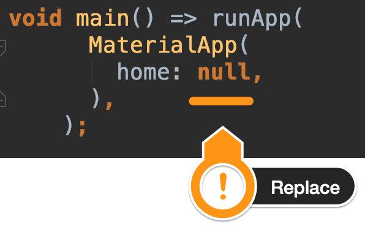
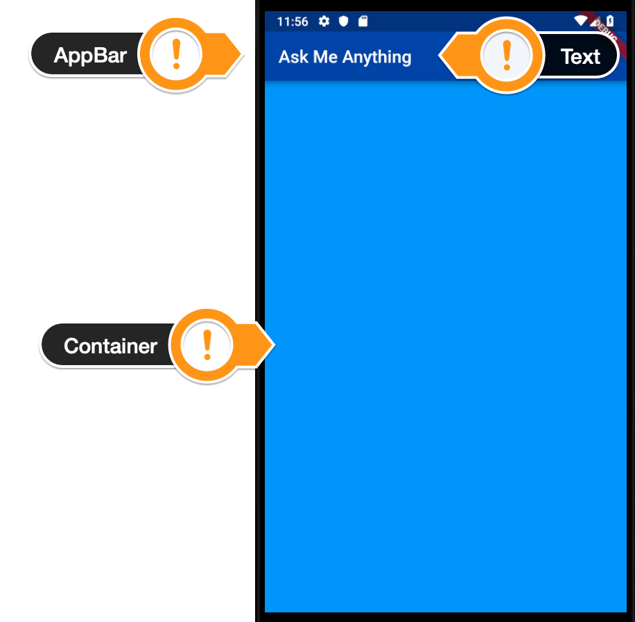
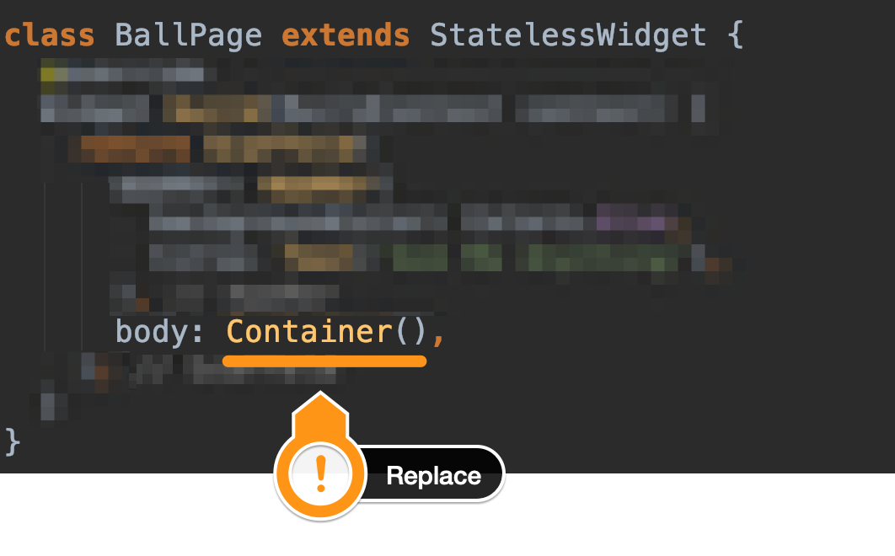
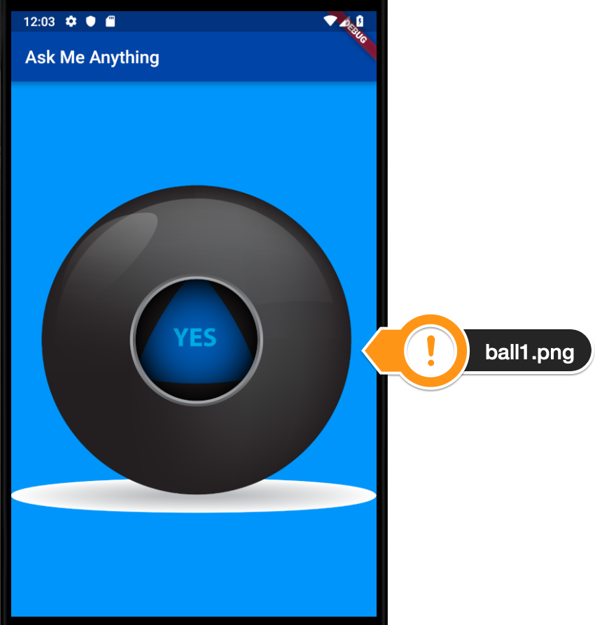
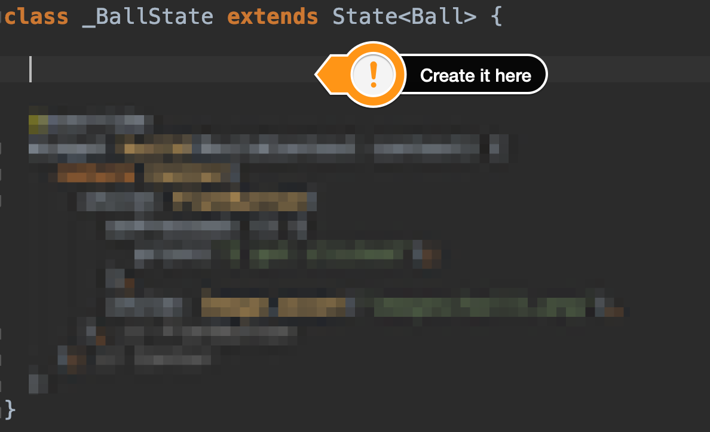
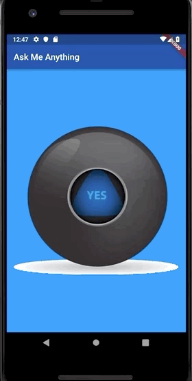

# Magic 8 Ball 🎱

## Our Goal

The objective of this challenge is to solidify what you've learn't in the Dicee tutorial. This app will guide you through the steps required to build an 8 ball app and you will be applying what you have learnt about Stateless and Stateful Flutter widgets.

## What you will create

We’re going to make a magical 8 ball app, it will give you the answers to all the tricky questions in life. You can make the ball change at the press of a button. 

## Magic 8 Ball Steps - Boss Challenge

  
1. Set Up The Project

  Go to https://github.com/londonappbrewery/magic-8-ball-flutter and clone the starting project to your local computer or just download the images in the images subfolder in the root. Open it and take a look around the project.

  - There is an images folder with all the ball images you will need. There are a total of 5 images.

  
2. Create a Stateless Widget

  
  - Create a new Stateless widget called BallPage in your main.dart file.

  - Replace the word null with the new Stateless Widget you created.
  

  - Your BallPage should have a Scaffold with an AppBar and an empty Container as the body.

  - The AppBar should have a  dark blue backgroundColor and a title that says 'Ask Me Anything'.

  - The background your Scaffold should have a blue color.

  - Once you run the app this is what you're aiming for:
  

  [Solution](../general_resources/challenges-steps/magic-8-ball/solutions/step_2.dart)

  
3. Create a Stateful Widget

  
  - Create a new [Stateful Widget](https://docs.flutter.io/flutter/widgets/StatefulWidget-class.html) called `Ball` in your **main.dart** file.

  - Instead of `BallPage` having a body of `Container()` replace it with your new **Stateful Widget**.
  

  - Your `Ball` Stateful Widget should display a the **ball1.png** image. (You don't have to touch the pubscpec.yaml file)

  - Make sure the image is **centered**.

  - When you run the app this is what you're aiming for:
  

  [Solution](../general_resources/challenges-steps/magic-8-ball/solutions/step_3.dart)

  
4. Make it Interactive

  
  - Use a [TextButton](https://api.flutter.dev/flutter/material/TextButton-class.html) Widget to make the Image **clickable**.

  - Add a `print` statement that gets triggered when the button is **pressed**. It should print `'I got clicked'`.

  - When you **run** the app and click on the ball image you should see the words "I got clicked" into the console like this:
  

  [Solution](../general_resources/challenges-steps/magic-8-ball/solutions/step_4.dart)

  
5. Randomize it

  - Inside the curly braces of `_BallState` create a [variable](https://www.dartlang.org/guides/language/language-tour#variables) called `ballNumber` that can only hold **integers** (`int`), set it to equal **0**.
  

  - Instead of hard coding the ball image name that's being displayed on screen, use the `ballNumber` **variable** you just created instead.

  - Add the `dart:math` [library](https://api.dartlang.org/stable/2.2.0/dart-math/dart-math-library.html) to your **main.dart** file.

  - When the button gets **pressed**, use the `Random()` generator and the `nextInt()` method from the `dart:math` library to generate a new `ballNumber` between **0-4**.

  - Print the `ballNumber` to the console when the button gets pressed.

  - When you **run** the app and **click** on the ball image you should see **random number between 0-4** printed in the console like this:
  

  [Solution](../general_resources/challenges-steps/magic-8-ball/solutions/step_5.dart)

  
6. Update the State

  - Change the random numbers that are generated for `ballNumber` from **0-4** to **1-5** to match our ball image names. 

  - Instead of using a **hard coded** image name to display the ball image that's shown on screen, use [String Interpolation](https://www.dartlang.org/guides/language/language-tour#strings) and the `ballNumber` **variable** instead to make it show a **random image**.

  - Use `setState()` to update the **state of the image** when the `ballNumber` variable **updates**.

  - All going well, you should now have the full functionality of the Magic 8 Ball app, it should look like this:
  

  

    <h4>
      <a href="../general_resources/challenges-steps/magic-8-ball/solutions/step_6.dart">Solution</a>
    </h4>
  

---

[Online Flutter Docs](https://docs.flutter.dev/)